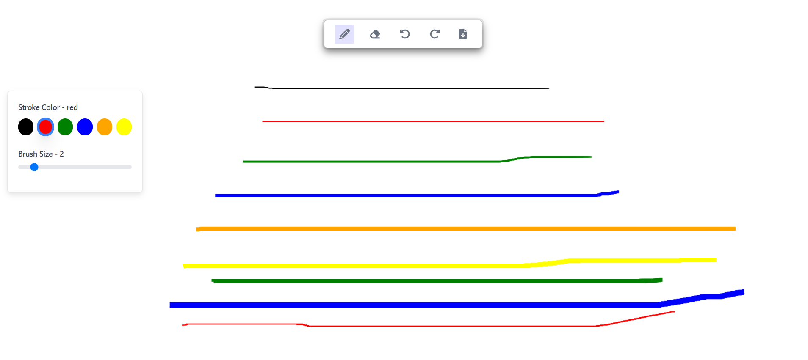
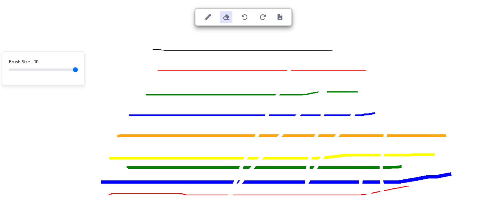
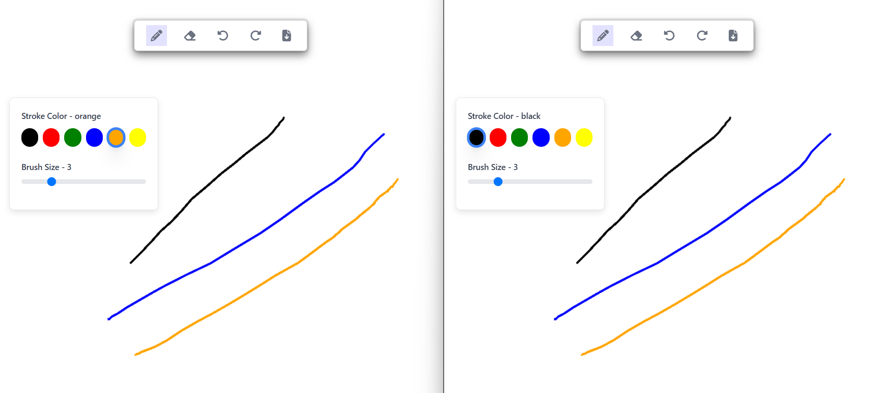

# 🎨 Drawing Board Application


A feature-rich **Drawing Board Application** designed to provide a seamless and interactive canvas experience. Built with modern technologies, this app allows users to create, edit, and **save(download)** their artistic creations effortlessly.

---

## 🚀 Tech Stack

This project leverages a powerful combination of frontend and backend technologies:

- **Frontend:**

  - **JavaScript:** Core scripting language for functionality.
  - **Next.js:** Framework for server-side rendering and fast frontend performance.
  - **Redux + Redux Toolkit:** State management for handling drawing tools and user interactions.
  - **TailwindCSS:** Utility-first CSS framework for a sleek and responsive UI.
  - **Canvas API:** For rendering the drawing area and handling all drawing operations.

- **Backend:**
  - **Node.js:** JavaScript runtime for the server-side backend.
  - **Express:** Lightweight and fast backend framework.
  - **WebSockets:** Real-time communication between users for collaborative drawing.

---

## ✨ Features

1. **Brush Tool:**

   - Draw effortlessly on the canvas.
   - Choose from a palette of vibrant colors to customize your strokes.

2. **Eraser Tool:**

   - Erase specific parts of your drawing with precision.

3. **Redo and Undo Functionality:**

   - Undo your last action or redo it, ensuring maximum flexibility.

4. **Download Button:**
   - Save your masterpiece as an image directly to your device with one click.

---

## 🖌️ User Interface Overview

- A **toolbox** provides easy access to brush size, color selection, and eraser options.
- The **canvas** supports responsive resizing, ensuring a smooth drawing experience across devices.
- Functionalities are intuitive, making it suitable for both beginners and seasoned artists.

---

## 🚀 How It Works

1. **Select a Tool**: Choose between the brush, eraser, or navigation options (Undo/Redo).
2. **Customize Settings**: Adjust brush size and select from a variety of colors.
3. **Draw**: Start creating your artwork on the canvas.
4. **Save Your Work**: Use the download button to save your drawing as an image file.

---

## 🛠️ How to Run the Project Locally

1. **Clone the Repository:**
   ```bash
   git clone https://github.com/aryan2574/drawing-white-board
   cd drawing-board
   ```
2. **Install Dependencies:**
   ```bash
   npm install
   ```
3. **Run the Development Server:**
   ```bash
   npm run dev
   ```
4. **Open [http://localhost:3000](http://localhost:3000) in Your Browser.**

5. **Connect websocket server**
   _open new terminal and run the following commands_
   ```bash
   cd backend
   npm install
   npm start
   ```
6. **Use the Drawing Board Application Locally.**

---

## 🎯 **Future Enhancements**

1. **Collaborative Drawing:**
   - Allow multiple users to draw on the same canvas simultaneously.
   - Implement real-time collaboration using WebSockets.
2. **Additional Drawing Tools:**
   - Introduce more tools like shapes, text, and patterns.
   - Enhance the user experience with a wider range of creative options.
3. **User Authentication:**
   - Enable user accounts to save and share drawings.
   - Implement user profiles and personalized settings.
4. **Mobile Application:**
   - Develop a mobile version of the app for on-the-go creativity.
   - Optimize the UI for touch-based interactions.
5. **Advanced Export Options:**
   - Provide more file formats for saving drawings.
   - Allow users to share their artwork directly on social media platforms.

---

## 🖼️ Screenshots

**Brush Tool**


**Eraser Tool**


**Collaborative Drawing**


---

## 🎨 Start Drawing Today and Bring Your Ideas to Life!
